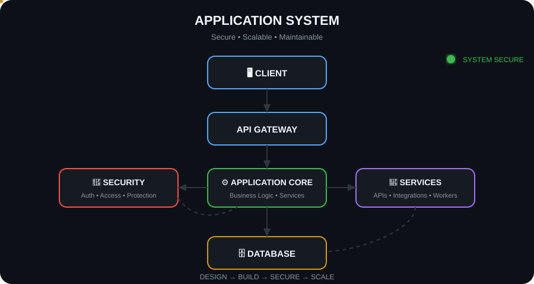

# 👋 Hi, I'm Sudheera

### Cybersecurity Undergraduate • Software Engineer • Application Architecture Enthusiast

  

---

### 🏗️ Application Architecture & Engineering Flow

> *"I don't just build features — I engineer the system behind them. Security and scalability must be built-in, not bolted on."*

  

---

### 🧑‍💻 About Me

* 🎓 **Cybersecurity & Engineering**: Undergraduate from Sri Lanka passionate about the intersection of Software Engineering, Cybersecurity, and System Design.
* 🏗️ **System Thinking**: Focused on end-to-end architecture — from intuitive frontends and secure API gateways to scalable business logic, data models, and network infrastructure.
* 🛡️ **Security by Design**: Dedicated to building hardened applications featuring robust authentication, RBAC, attack surface reduction, and fault-tolerant communication.

---

### 🚀 Featured Systems & Projects

| Project | Domain | Key Architecture & Capabilities |
| :--- | :--- | :--- |
| 🧩 **Steganography CTF Box** | `Offensive Security` `Forensics` | Interactive security challenge environment simulating modern steganographic data exfiltration and defensive forensic analysis. |
| 🚚 **Supply Chain & Logistics System** | `Full-Stack Architecture` `Enterprise` | Real-world business platform with role-based access control (RBAC), live delivery tracking, multi-tier workflows, and resilient data handling. |
| 🛡️ **Hardened Enterprise Web Platform** | `AppSec` `API Security` | Business administration system engineered around zero-trust principles, secure session handling, audit trails, and defensible service boundaries. |

---

### 🛠️ Tech Stack & Tooling

| Domain | Technologies |
| :--- | :--- |
| **Languages** |      |
| **Web & Frameworks** |     |
| **Databases** |  |
| **Security & Systems** |     |

---

### 📊 GitHub Activity & Insights

  
  

---

### 🌐 Design • Build • Secure • Scale

[Portfolio](https://architecturelogic.github.io/portfolio/) • [LinkedIn](https://www.linkedin.com/in/sudheera-perera-576552297) • [Email](mailto:sudheera2027@gmail.com)

